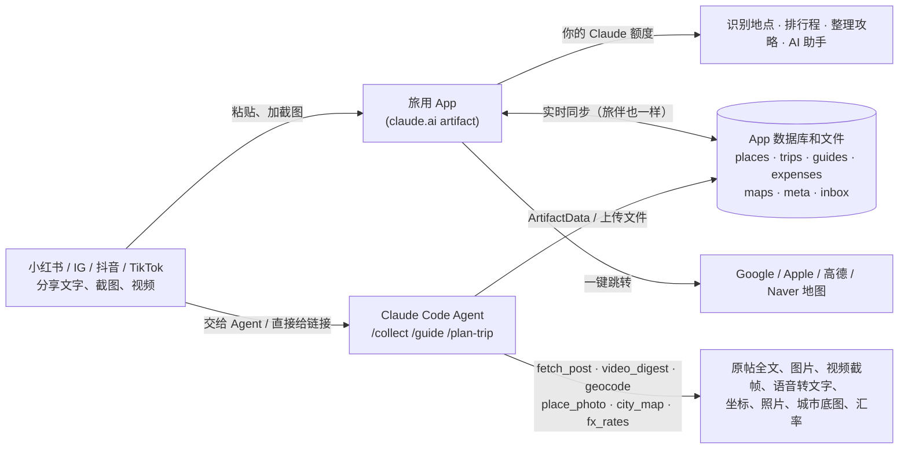

# 旅用 · 收藏的地方，排成能走的路线

在小红书、Instagram Reels、抖音、TikTok 上看到想去的店和景点，不管在哪个国家，把分享链接（或截图）丢进来，AI 帮你记下
店名、必吃、避坑提示，配上照片；选好城市和天数（一个城市或 首尔 → 釜山 这样连着走），自动排出每天顺路的行程，
每一段都告诉你坐什么车、多久、多少钱，并能一键打开地图导航。花费自动换算成马币 RM，旅伴可以一起收藏、一起编辑。
看到"教你怎么走"的攻略或 vlog，也能整理成一步一步照着走的指引。

**App 地址（只有你和你分享的人能打开）：https://claude.ai/artifact/SzMZpqMzGwh9dwb2nKyVYA**

里面放了几个国家的示例：「首尔釜山 5 日」（前 3 天首尔，第 4 天坐 KTX 去釜山，带 5 笔花费和旅伴结算）、
首尔、釜山、曼谷、巴黎共 21 个带照片的地点，和 1 篇「仁川机场到明洞」攻略。看完效果可以在 设置 → 清除示例 一键删掉
（你自己收藏的地点不会被删）。

---

## 能做到吗？

能。你想要的几件事，以及它们是怎么做到的：

| 你想要的 | 怎么做到 | 状态 |
|---|---|---|
| 把小红书 / IG / 抖音的链接贴进去就收藏 | 首页「保存旅行灵感」粘贴分享文字 + 截图（或视频，会自动截帧），Claude 读出里面的店和景点。Agent：直接读原帖全文和所有图片 | ✅ |
| 收藏的地方和美食分城市、分类管理 | 「收藏」页：照片卡片，按城市 / 景点 / 美食 / 购物筛选，♡ 标记想去，去过后标记「去过」；「地图模式」在真实地图上看照片图钉 | ✅ |
| 选好后自动排行程 | 先按地理位置把地点分到每一天（不走回头路），再由 Claude 考虑营业时间、饭点、日落排时间表；支持多城市和当天往返 | ✅ |
| 告诉我用什么交通去哪里 | 时间线里每两站之间写明 地铁/巴士/步行、几分钟、哪条线、多少钱；点「路线」打开 Google / Apple / 高德 / Naver 地图看实时班次 | ✅ |
| 看了小红书的教学视频，教我怎么走 | 「行程」页 →「跟着攻略走」：整理成分步指引（几号出口、坐哪条线、走几分钟），每步带导航；视频交给 Agent 还会把语音转成文字 | ✅ |
| 和旅伴一起用 | 在 claude.ai 分享给旅伴并给「可以编辑」：大家看到同一份收藏、行程和花费，谁加的会显示头像 | ✅ |
| 花费换算成 RM | 每段车费和门票餐费有 AI 预估；「花费」页随手记一笔，按每日汇率换算成 RM，对照预算 | ✅ |
| AI 旅行助手 | 根据你们的收藏回答问题、给路线建议；要改数据时只给建议卡片，你点确认后才会改 | ✅ |
| 尽量免费 | 不用任何付费 API，不用申请 API key（见下方「费用」） | ✅ |

## 怎么用

### 方式一：手机上直接用 App（最简单）

底部四个页面：**首页 · 收藏 · 行程 · AI 助手**（电脑上在左侧）。

1. 打开上面的 App 链接（手机上用 Claude App 或浏览器登录 claude.ai）。
2. **保存灵感**：在小红书点「分享 → 复制链接」，回到首页粘贴，点绿色箭头；再**加几张笔记截图**，小红书攻略的店名常写在图里。
   视频可以直接选，App 会自动截 8 张画面。点「AI 识别地点」→ 勾选要的 → 收藏。第一张截图会当作地点照片。
3. **排行程**：「行程」→「新行程」，按顺序选城市（可以多个）、总天数（每个城市可以再调）、每个城市住哪里、
   日期、节奏、交通、预算 → 生成。行程页有五个标签：
   - **行程**：每天的照片时间线，每段交通和「路线」导航；不满意点「用 AI 优化这一天」写一句（"太赶了"），改动的地方会用黄色标出来。
   - **地图**：当天路线按顺序编号画在城市地图上，一键在 Google Maps 打开全程。
   - **花费**：AI 预估每人每天花多少（当地货币 ≈ RM），随手「记一笔」，按类别汇总，对照预算。
   - **待安排**：收藏了但还没排进去的地点，点「让 AI 排进行程」。
   - **概览**：进度、每天的区域、住宿、AI 小贴士、旅伴。
4. **AI 助手**：点「规划行程」「找美食」「下雨天备选」等快捷问题，或者直接问。它要改数据时会给一张卡片，你点「确认」才会动。
5. **跟着攻略走**：「行程」页下方 → 整理攻略，贴上攻略文字或截图 / 视频，得到分步走法。
6. 出发前：行程右上角「⋯」→ 复制文字发给旅伴，或导出 Markdown。设置里还能导出 CSV，导入 Google My Maps。

> App 里的 Claude 打不开外部链接（安全限制），只能看到你粘贴的文字和图片。只有链接时，用下面的 Agent。

### 方式二：交给 Agent 自动读取原帖（Claude Code）

Agent 就是在 Claude Code 里运行的 Claude，配上这个仓库里的工具和技能（skills）：

| 命令 | 作用 |
|---|---|
| `/collect <分享文字或链接>` | 读取原帖全文和所有图片（视频会截帧、转文字），提取地点，查准确坐标，配照片（优先用帖子里的图，没有就用维基百科的免费照片并署名），写进 App 的「收藏」；新城市还会画一张城市底图 |
| `/collect`（不带参数） | 处理你在 App 里点了「交给 Agent」的所有链接（首页会提示有几条在等） |
| `/guide <视频或攻略链接>` | 看完视频 / 图文，整理成分步走法，写进 App 的「跟着攻略走」 |
| `/plan-trip` | 用你收藏的地点排行程（单城或多城，坐标更准，写上车费），顺便更新汇率，写进 App 的「行程」 |

用法：在 Claude Code（网页版 claude.ai/code、手机 Claude App 的 Code、或电脑终端）打开仓库 `mshen0/travel-planner`，
输入上面的命令。云端会话启动时会自动安装需要的工具（yt-dlp）。

各平台在云端能读到什么：

| 平台 | 云端 Agent | 你自己电脑上的 Agent |
|---|---|---|
| 小红书 | ✅ 全文、话题、所有图片、视频 | ✅ |
| TikTok / YouTube | ✅ 标题和简介；视频下载常被拦 | ✅（可加 `--cookies-from-browser chrome`） |
| B站 / 抖音 | ⚠️ 海外服务器常被限制，分享文字里的标题会保留 | ✅ |
| Instagram | ⚠️ 公开的 Reel 通常能读到文案和视频（会截帧看画面里的店名）；要求登录时 → 改用截图或复制文案 | ✅ 加 `--cookies-from-browser chrome` |

## 费用

| 部分 | 用什么 | 花费 |
|---|---|---|
| AI 识别、排行程、整理攻略、AI 助手 | 看页面那个人自己的 Claude 账号额度（App 通过 claude.ai 调用，Agent 就是 Claude Code） | 不另外收费 |
| 数据和照片保存 | claude.ai artifact 自带的数据库和文件存储 | 免费 |
| 地点照片 | 帖子里的图；没有就用 Wikimedia Commons 的免费授权照片（署名作者和授权） | 免费 |
| 城市地图底图 | OpenFreeMap（OpenStreetMap 数据）矢量图，Agent 渲染成图片 | 免费 |
| 坐标查询 | OpenStreetMap（Nominatim、Photon） | 免费 |
| 汇率 | open.er-api.com，备用欧洲央行（Frankfurter） | 免费 |
| 读取帖子 / 视频 | 自己写的脚本 + yt-dlp + ffmpeg | 免费、开源 |
| 语音转文字（可选） | faster-whisper，在本机运行 | 免费（第一次下载约 500 MB 模型） |
| 导航和实时班次 | 跳转到 Google / Apple / 高德 / Naver 地图 App | 免费 |

## 工作原理



- 排行程分两步：先用程序按距离把地点分到每天（容量受限的 k-means + 最近邻 + 2-opt，不走回头路），
  再把分组、坐标、营业时间交给 Claude 排时间和交通。多城市时按城市顺序分天，换城市那天第一站是城际交通。App 和 Agent 用的是同一套分组方法。
- 地图链接按地区自动选：中国大陆用高德（没有精确坐标时用百度按名字导航），韩国用 Naver，其他用 Google；设置里可以改。
- 照片、地图都存在 App 自己的文件存储里（artifact 页面不能加载外部图片），每张都记着出处。

## 需要知道的限制

- **交通时间、线路和花费是 Claude 估计的**，常见城市基本准确，但会有出入；出发前点每段的「路线」看地图 App 的实时班次。
- 城市地图底图要 Agent 画一次（`/collect` 或 `/plan-trip` 会自动画）；还没有底图的城市先显示按坐标画的示意图。
- 汇率每天更新一次（Agent 运行 `/plan-trip` 时）；想用自己换汇的汇率，在 设置 → 货币和汇率 里手动填。
- 没写具体分店的连锁店（"一兰拉面，分店都一样"）不会被钉在某一家，排行程时会挑当天路线附近的分店。
- OpenStreetMap 对中国大陆小店的覆盖较少，这些店用 Claude 估计的大概位置。小店通常没有维基百科照片，会显示分类图标。
- 社交平台会改版和加强反爬，读取方法可能失效；失效时截图永远可用。
- 和 AI 助手的聊天只存在自己的设备上，旅伴看不到。

## 想让它更自动？

可以在 Claude Code 里建一个定时任务（Routine），比如每天晚上自动运行一次 `/collect`，把你白天在 App 里点了「交给 Agent」的链接全部处理掉。
会用到你的 Claude 额度。需要的话直接跟 Claude 说"帮我设一个每天 22:00 运行 /collect 的定时任务"。

## 文件结构

```
app/bacao.html                 App（单个 HTML 文件，发布为 claude.ai artifact）
tools/fetch_post.py            分享文字 / 链接 → 帖子内容 JSON（可下载图片）
tools/video_digest.py          视频 → 截帧、拼图、字幕或语音转文字
tools/geocode.py               免费坐标查询（OpenStreetMap），带缓存
tools/trip_helper.py           按地理位置分天、排顺序（和 App 同一算法）
tools/place_photo.py           维基百科 / Wikimedia Commons 免费照片 + 署名
tools/city_map.mjs             画城市底图（OpenFreeMap，浅色 + 深色）
tools/fx_rates.py              免费汇率（换算 RM）
tools/provenance.py            在图片里记下出处
.claude/skills/collect|guide|plan-trip/   Agent 技能（/collect /guide /plan-trip）
.claude/hooks/session-start.sh 云端会话启动时安装依赖
CLAUDE.md                      给 Claude 看的说明：数据库结构和规则
PRODUCT.md / DESIGN.md         产品定位和视觉设计规范（颜色、字体、组件）
travel.config.json             App 地址、语言、本国货币
tests/                         单元测试和浏览器冒烟测试
```

## 开发

```bash
pip install -r tools/requirements.txt pytest
python3 -m pytest -q tests/              # Python 工具
node --test tests/*.test.mjs             # App 里的纯逻辑（链接解析、分天、多城市、汇率、地图投影…）和底图工具
node tests/e2e/smoke.mjs                 # 用模拟的 claude.ai 运行环境在 Chromium 里点一遍所有页面和流程（需要 Playwright、ffmpeg）
```

改了 `app/bacao.html` 之后，用 Claude Code 的 Artifact 工具发布到同一个地址（`travel.config.json` 里的 `appUrl`），数据会保留。
