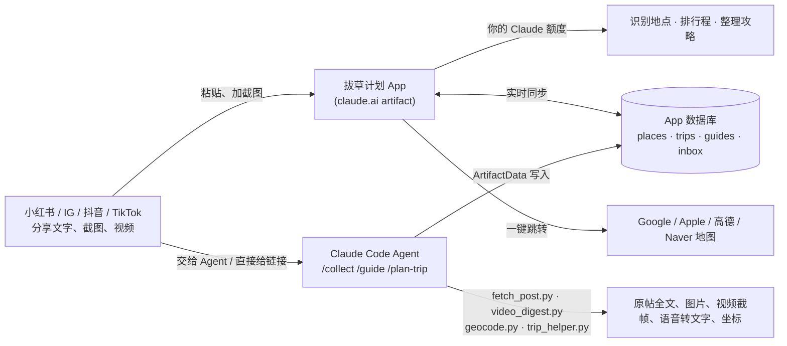

# 拔草计划 · 种草的店，排成能走的路线

在小红书、Instagram Reels、抖音、TikTok 上看到想去的店和景点，把分享链接（或截图）丢进来，AI 帮你记下店名、
必吃、避坑提示；选好城市和天数，自动排出每天顺路的行程，每一段都告诉你坐什么车、多久、多少钱，并能一键打开地图导航。
看到"教你怎么走"的攻略或 vlog，也能整理成一步一步照着走的指引。

**App 地址（只有你能打开）：https://claude.ai/artifact/SzMZpqMzGwh9dwb2nKyVYA**

里面已经放了一份用真实小红书攻略做的「东京」示例（19 个地点、3 天行程、1 篇一日游攻略），看完效果可以在
设置 → 清除示例 一键删掉。

---

## 能做到吗？

能。你想要的几件事，以及它们是怎么做到的：

| 你想要的 | 怎么做到 | 状态 |
|---|---|---|
| 把小红书 / IG / 抖音的链接贴进去就收藏 | App 里：粘贴分享文字 + 截图（或视频，会自动截帧），Claude 读出里面的店和景点。Agent：直接读原帖全文和所有图片 | ✅ |
| 收藏的地方和美食分城市、分类管理 | 「种草」页：按城市 / 美食 / 景点 / 购物筛选，标记 种草 → 想去 → 已拔草 | ✅ |
| 选好后自动排行程 | 先按地理位置把地点分到每一天（不走回头路），再由 Claude 考虑营业时间、饭点、日落时间排出时间表 | ✅ |
| 告诉我用什么交通去哪里 | 每两站之间写明 地铁/巴士/步行、几分钟、哪条线、多少钱；点「路线」打开 Google / Apple / 高德 / Naver 地图看实时班次 | ✅ |
| 看了小红书的教学视频，教我怎么走 | 「攻略」页：整理成分步指引（几号出口、坐哪条线、走几分钟），每步带导航；视频交给 Agent 还会把语音转成文字 | ✅ |
| 尽量免费 | 不用任何付费 API，不用申请 API key（见下方「费用」） | ✅ |

## 怎么用

### 方式一：手机上直接用 App（最简单）

1. 打开上面的 App 链接（手机上用 Claude App 或浏览器登录 claude.ai）。
2. **添加种草**：在小红书点「分享 → 复制链接」，回到 App 点「添加」粘贴；再**加几张笔记截图**，小红书攻略的店名常写在图里。
   视频可以直接选，App 会自动截 8 张画面。点「AI 识别地点」→ 勾选要的 → 种草。
3. **排行程**：在某个城市旁边点「排 东京 行程」，选天数、住哪里、节奏、交通 → 生成。
   不满意就在「想调整？」里写一句（"第二天太赶了"），Claude 会重排。
4. **跟着攻略走**：「攻略」页 → 整理攻略，贴上攻略文字或截图 / 视频，得到分步走法。
5. 出发前：「复制文字」发给旅伴，或「导出 Markdown」。设置里还能导出 CSV，导入 Google My Maps 在手机地图上看全部种草点。

> App 里的 Claude 打不开外部链接（安全限制），只能看到你粘贴的文字和图片。只有链接时，用下面的 Agent。

### 方式二：交给 Agent 自动读取原帖（Claude Code）

Agent 就是在 Claude Code 里运行的 Claude，配上这个仓库里的工具和技能（skills）：

| 命令 | 作用 |
|---|---|
| `/collect <分享文字或链接>` | 读取原帖全文和所有图片（视频会截帧、转文字），提取地点，查准确坐标，写进 App 的「种草」 |
| `/collect`（不带参数） | 处理你在 App 里点了「交给 Agent」的所有链接（「待处理」页） |
| `/guide <视频或攻略链接>` | 看完视频 / 图文，整理成分步走法，写进 App 的「攻略」 |
| `/plan-trip` | 用你种草的地点排行程（坐标更准），写进 App 的「行程」 |

用法：在 Claude Code（网页版 claude.ai/code、手机 Claude App 的 Code、或电脑终端）打开仓库 `mshen0/travel-planner`，
输入上面的命令。云端会话启动时会自动安装需要的工具（yt-dlp）。

各平台在云端能读到什么：

| 平台 | 云端 Agent | 你自己电脑上的 Agent |
|---|---|---|
| 小红书 | ✅ 全文、话题、所有图片、视频 | ✅ |
| TikTok / YouTube | ✅ 标题和简介；视频下载常被拦 | ✅（可加 `--cookies-from-browser chrome`） |
| B站 / 抖音 | ⚠️ 海外服务器常被限制，分享文字里的标题会保留 | ✅ |
| Instagram | ❌ 要求登录 → 改用截图或复制文案 | ✅ 加 `--cookies-from-browser chrome` |

## 费用

| 部分 | 用什么 | 花费 |
|---|---|---|
| AI 识别、排行程、整理攻略 | 你自己 Claude 账号的额度（App 通过 claude.ai 调用，Agent 就是 Claude Code） | 不另外收费 |
| 数据保存 | claude.ai artifact 自带的数据库 | 免费 |
| 坐标查询 | OpenStreetMap（Nominatim、Photon） | 免费 |
| 读取帖子 / 视频 | 自己写的脚本 + yt-dlp + ffmpeg | 免费、开源 |
| 语音转文字（可选） | faster-whisper，在本机运行 | 免费（第一次下载约 500 MB 模型） |
| 导航和实时班次 | 跳转到 Google / Apple / 高德 / Naver 地图 App | 免费 |

## 工作原理



- 排行程分两步：先用程序按距离把地点分到每天（容量受限的 k-means + 最近邻 + 2-opt，不走回头路），
  再把分组、坐标、营业时间交给 Claude 排时间和交通。App 和 Agent 用的是同一套分组方法。
- 地图链接按地区自动选：中国大陆用高德（没有精确坐标时用百度按名字导航），韩国用 Naver，其他用 Google；设置里可以改。

## 需要知道的限制

- **交通时间和线路是 Claude 估计的**，常见城市基本准确，但会有出入；出发前点每段的「路线」看地图 App 的实时班次。
- 行程页的地图是**示意图**（按坐标画的路线，没有底图），因为 artifact 页面不能加载外部地图。看真实地图请用导航链接，或导出 CSV 到 Google My Maps。
- 没写具体分店的连锁店（"一兰拉面，分店都一样"）不会被钉在某一家，排行程时会挑当天路线附近的分店。
- OpenStreetMap 对中国大陆小店的覆盖较少，这些店用 Claude 估计的大概位置。
- 社交平台会改版和加强反爬，读取方法可能失效；失效时截图永远可用。

## 想让它更自动？

可以在 Claude Code 里建一个定时任务（Routine），比如每天晚上自动运行一次 `/collect`，把你白天在 App 里点了「交给 Agent」的链接全部处理掉。
会用到你的 Claude 额度。需要的话直接跟 Claude 说"帮我设一个每天 22:00 运行 /collect 的定时任务"。

## 文件结构

```
app/bacao.html                 App（单个 HTML 文件，发布为 claude.ai artifact）
tools/fetch_post.py            分享文字 / 链接 → 帖子内容 JSON
tools/video_digest.py          视频 → 截帧、拼图、字幕或语音转文字
tools/geocode.py               免费坐标查询（OpenStreetMap），带缓存
tools/trip_helper.py           按地理位置分天、排顺序（和 App 同一算法）
.claude/skills/collect|guide|plan-trip/   Agent 技能（/collect /guide /plan-trip）
.claude/hooks/session-start.sh 云端会话启动时安装依赖
CLAUDE.md                      给 Claude 看的说明：数据库结构和规则
travel.config.json             App 地址等配置
tests/                         单元测试和浏览器冒烟测试
```

## 开发

```bash
pip install -r tools/requirements.txt pytest
python3 -m pytest -q tests/              # Python 工具
node --test tests/app_lib.test.mjs       # App 里的纯逻辑（链接解析、分天、地图链接、导出…）
node tests/e2e/smoke.mjs                 # 用模拟的 claude.ai 运行环境在 Chromium 里点一遍所有流程（需要 Playwright、ffmpeg）
```

改了 `app/bacao.html` 之后，用 Claude Code 的 Artifact 工具发布到同一个地址（`travel.config.json` 里的 `appUrl`），数据会保留。
